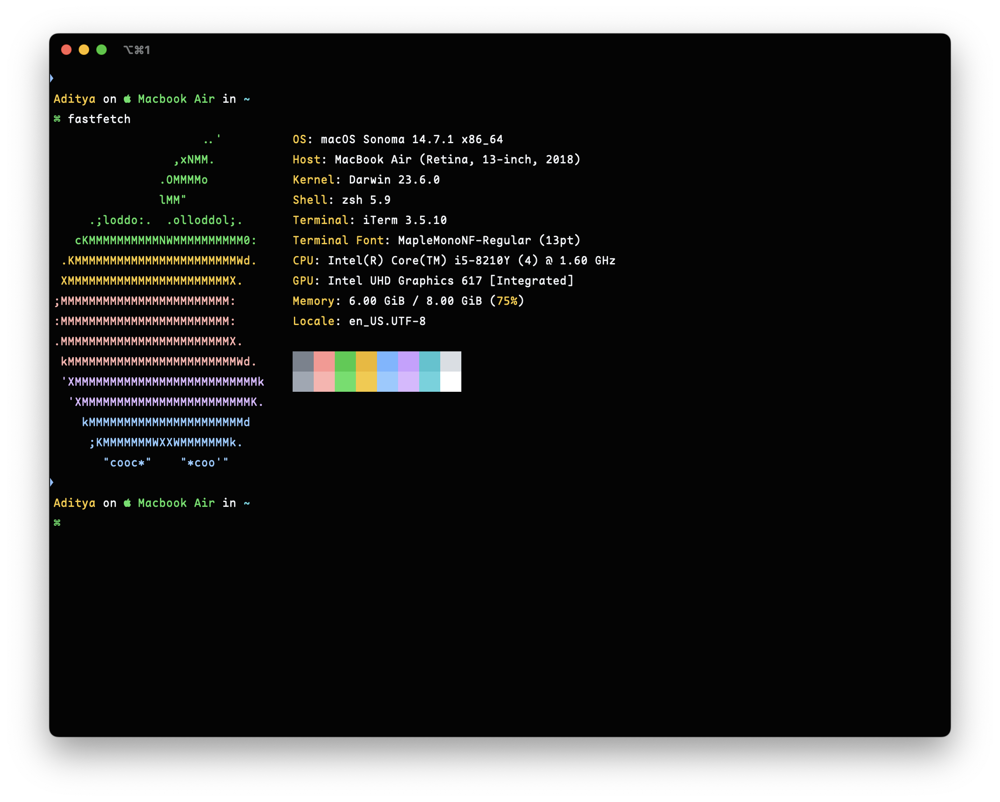
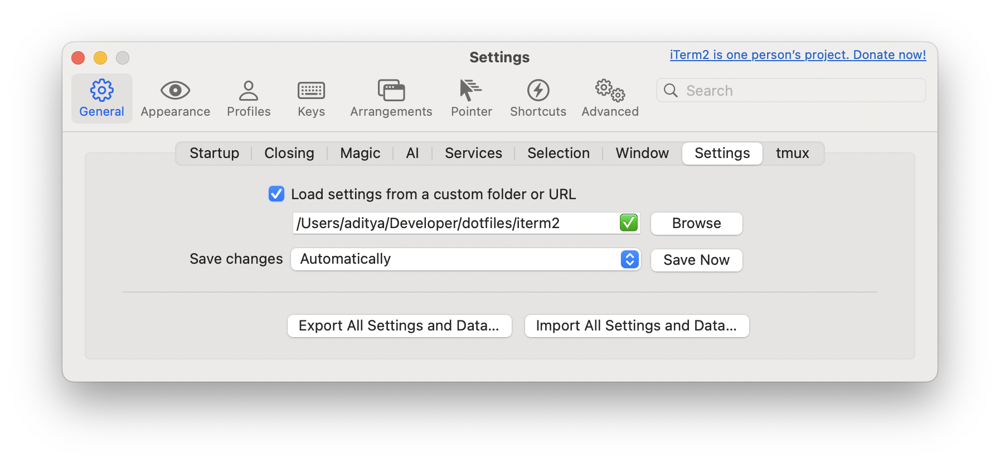

# iTerm2

iTerm2 is my preferred terminal. It's a feature-rich and open source alternative to the default Terminal app on MacOS.

## Backup and restore preferences

iTerm2 allows you to save its preferences to a file for easy backup and syncing.

Open iTerm2 preferences:

1. iTerm2 → Preferences (or press Cmd + ,).
2. Go to the General tab.
3. Select "Load settings from a custom folder or URL"

## Useful links

[GitHub theme for iTerm2](https://github.com/cdalvaro/github-vscode-theme-iterm/)
